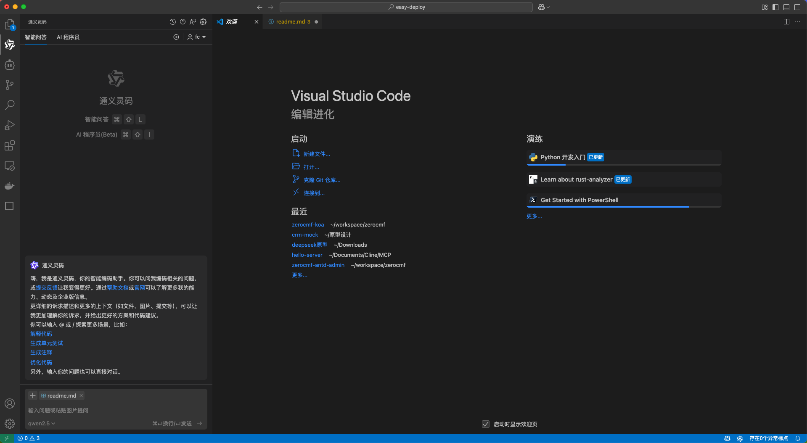

随着 AI 的飞速发展，我开始思考如何用 AI 辅助代码开发。经过多次实践，我总结出了一套高效的 AI 开发流程，今天就来和大家分享！

hello大家好，我是frank ，一名热爱开源的全栈开发者。我想和大家分享如何用 AI 高效完成业务开发。在开发之前，我先介绍一下此次项目的背景和需求。

在我完成我的开源zerocmf快速开发框架1.0版本之后，我想让用户随时在线预览。但每次手动部署太麻烦了，于是决定用 GitHub Action 实现自动化部署。

由于服务器是阿里云 ECS，每次部署都需要开启 22 端口并使用 scp-action 传输文件，但这种方式存在安全风险。所以，我计划开发一个 基于 HTTP 的 Web 部署服务，通过 API 远程触发部署任务。

我偏爱nodejs，所以我打算利用它来完成本次开发。接下来，我们就一起来完成这个项目吧。

# 前言

首页我们需要安装开发依赖：

1. nodejs
2. vscode (tongyi-lingma,cline等)/trae
3. chrome浏览器

## 创建空项目

```bash
mkdir workspace/easy-deploy
```

## 分析需求

1. nodejs
2. 支持上传文件到指定目录下（安全工作空间固定，只能上传到这个工作空间）
3. 支持nodejs项目绑定pm2并重启
4. 支持阿里云dns一键解析
5. 自动创建nginx站点，并配置https

## 核心需求

1. 使用env管理关环境变量
2. 支持用户名 + 私钥登录密钥进行身份验证
3. 用户名绑定合法目录

## 开始对话

本次项目我们以通义灵码为例，你可以使用你喜欢的开发工具或者插件



1.先告诉大模型我们基本的需求和要实现的功能：
